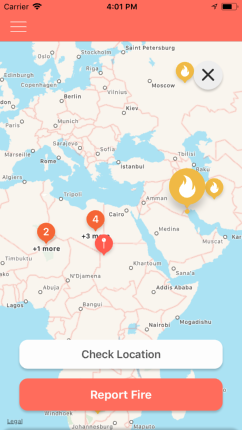
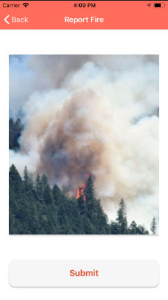
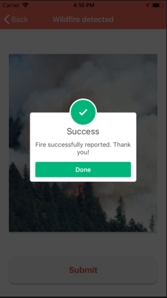

# FireWatch

FireWatch is a crowd sourcing tool aimed at communities at risk due to wildfire. The app helps users easily report wildfires by taking a photo and submitting it. Once the photo is confirmed through machine learning, authorities and citizens are alerted.

The project is an IOS application that uses crowd sourcing as a tool to allow any user to report a fire. The application uses machine learning for image recognition, allowing for early and instantaneous wildfire detection.

## Background Information

On average, it takes two to three hours for a satellite to recognize, confirm, and report a wildfire before response units can take action. FireWatch monumentally reduces the time it takes to report and rescue by allowing users to take photos of wildfire and alerting every other user within the vicinity of it, along with the appropriate rescue units needed. Furthermore, the manpower needed to put out a fire can be determined through inspection of the images.

## Why FireWatch, why not just call?

Usually when reporting a wild fire the time line goes as follows: Users make a phone call, emergency call centers answer and report the fire, authorities are alerted and respond accordingly, once the rescuers arrive at the scene of the fire the local area citizens begin to evacuate.
FireWatch however allows users to merge two steps into one. By allowing the user to simultaneously alert authorities and other users the evacuation process, in the case of confirmation, will be much easier and at a faster rate.

## The Idea:

Reports are uploaded to a database that all users can access through the application. Users may view specific pictures of fire in pinned locations on the map, however they will not be able to manipulate the data since it is automated. The application allows users to view pictures of active fires as they are being uploaded. Colours are used to indicate the number of wildfires within a region, and as a user zooms into the map the fire pins begin to de-cluster allowing a user to view specific locations with fire.

## Progress:

- User verification is done using phone numbers.
- The map with pins of wildfires around the world can be viewed.
- Users may report a fire by either uploading a pre-shot photo or live.
- Users may check the vicinity for existing and active fires.
- Once a report has been made users within the area are alerted, along side with authorities.
- Machine learning is used in order to identify wildfires.

The project was developed using XCode for iOS development, using the python language, the IBM Watson Developer Cloud for the machine learning model, and Adobe illustrator for art work and design.

## Future Works:

For future works the team would like to integrate smart sensors into both populated and unpopulated danger areas in order to collect constant information and send it to data centers. Data centers then automatically process the data and alert authorities in case of crisis. The team would also like to incorporate weather and traffic API's in order to inform users of potential danger areas as well as the routes to avoid them.
